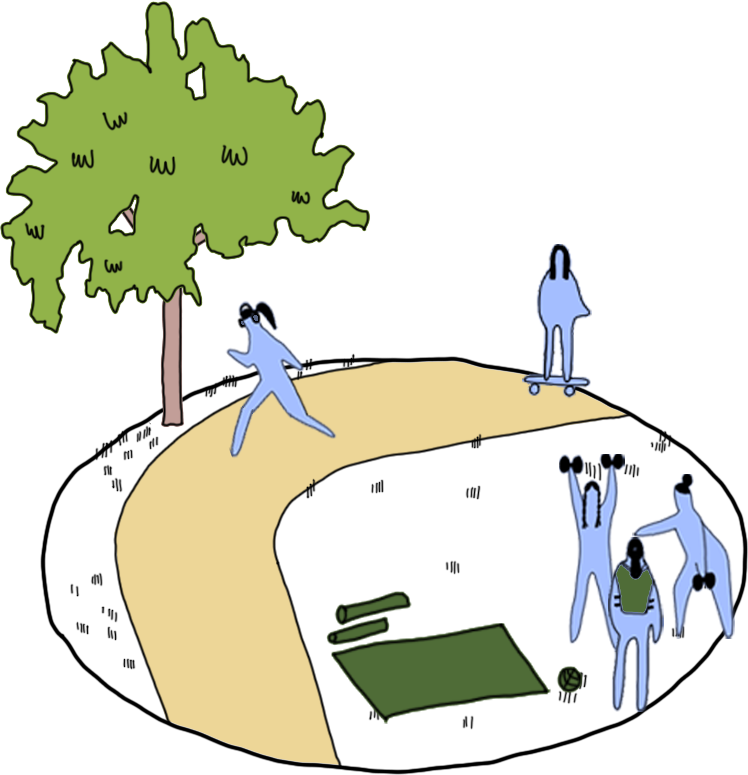
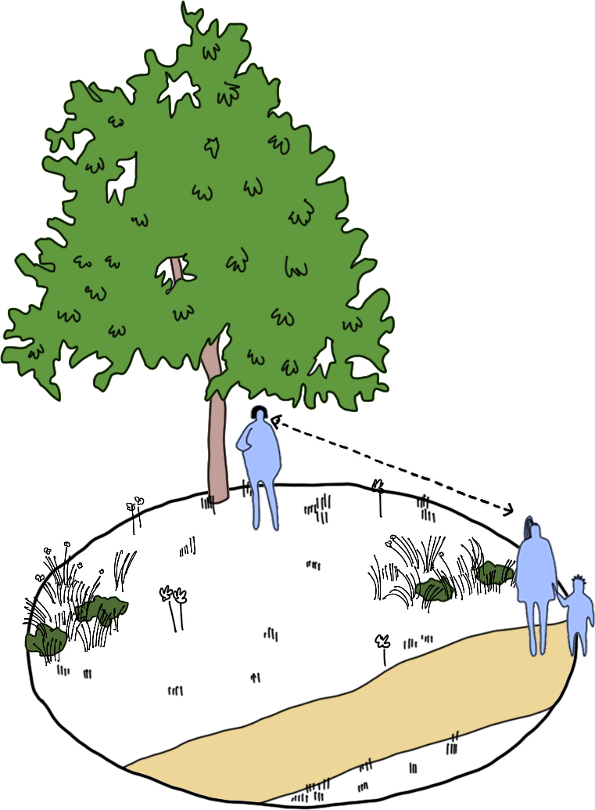
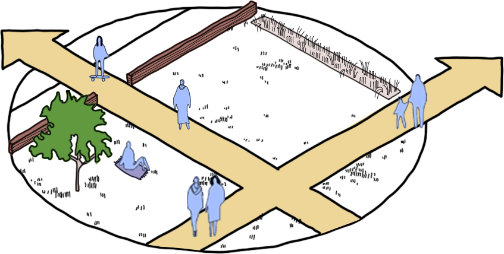

## A practical tool to strengthen park safety, design, and decision‑making

:::{.text-box3}

The Safer Parks Dashboard has been developed to support professionals working across crime prevention, parks management, and place‑shaping. It brings together [open spatial data](data.qmd) and the [principles of safer park design](https://www.makespaceforgirls.co.uk/resources/safer-parks-for-women-and-girls-guidance) to provide clear, actionable insight into improving feelings of safety for women and girls.

](assets/guidance.png){width="40%" fig-align="center" alt="Cover of the Safer Parks guidance document, showing a sketch of a park with trees, paths, and benches."}

Using the dashboard, partners can: 

::::{.column-page-inset-right}

- identify where lighting, visibility, or access improvements may be needed 
- understand movement patterns and likely footfall using network analysis (in development)
- assess park entrances, unofficial access points, and escape routes 
- review amenities such as benches, toilets, and play areas at both site and regional level 
::::

:::

::: {.column-screen}
; illustration credit: [Harper Perry](www.harperperry.co.uk).](assets/Safer-Parks-Strategy-Harper-Perry-05.jpg){fig-align="center" width="100%" fig-alt="Overview sketch of a park with trees, paths, benches, and a playground. The sketch is annotated with arrows and text highlighting entrances, escape routes, and areas of visibility."}
:::

:::{.text-box3}

By combining data layers, police and councils can target resources more effectively, aid scanning and analysis stages of SARA model problem-solving, inform Environmental Visual Audits, enhance patrol planning, undertake accessibility audits and strengthen park management plans. Friends of Parks groups and community organisations can also use the tool to inform local projects, identify opportunities, and collaborate with authorities. 
:::

[Our aim is simple: to make parks feel safer and more welcoming for women and girls, and to support the prevention of violence against women and girls (VAWG) in public spaces.]{.emphasis}

## The evidence base behind the dashboard 

:::{.text-box3}

The dashboard is grounded in *Safer Parks: Improving Access for Women and Girls*, guidance developed through extensive research and engagement with women and teenage girls, parks managers, urban designers, police, and others. This research identified the environmental and social factors that most influence feelings of safety and the guidance sets out ten guiding principles for safer park design and management, organised across three themes: 
:::

:::: {.column-page-inset}
::: {.grid}

::: {.g-col-12 .g-col-md-4}

::: {.text-box-eyes}
### Eyes on the Park 

Safety increases when parks feel welcoming, and well‑used. Everyday activity, programmed events, and routine footfall create natural surveillance. Visible, skilled staff and volunteers signal that the space is cared for and monitored. 

::: {.larger-bullets2}

- Busyness and Activation
- Staffing and Authority Figures

:::

:::
:::
  
::: {.g-col-12 .g-col-md-4}

::: {.text-box-aware}
### Awareness 

Design features that support awareness such as good visibility, suitable lighting, open sightlines and layouts that are easy to navigate help users feel secure. These elements reduce uncertainty, make escape routes clear, and help people intuitively understand the space around them. 

::: {.larger-bullets2}

- Visibility and Openness
- Escape
- Lighting
- Wayfinding and Layout

:::

:::

:::

::: {.g-col-12 .g-col-md-4}

:::{.text-box-incl}
### Inclusion 

A sense of belonging plays a vital role in safety. Inclusion means co‑producing parks with communities from early design through long‑term management, and creating environments that feel welcoming, familiar, and reflective of diverse needs and identities. 

::: {.larger-bullets2}

- Belonging and Familiarity
- Image
- Access and Location
- Co-production and Engagement

:::

:::

:::
  
:::

::: {.grid}

::: {.g-col-12 .g-col-md-4 .img-box}

{width="80%" fig-align="center" fig-alt="A sketch of a park with exercise classes with personal trainers taking place."}

:::
  
::: {.g-col-12 .g-col-md-4 .img-box}

{width="80%" fig-align="center" fig-alt="A sketch of a park showing sightlines and visibility through shrubbery and trees."}

:::

::: {.g-col-12 .g-col-md-4 .img-box}

{width="85%" fig-align="center" fig-alt="A sketch of a park with multiple exists highlighted."}

:::

:::

::: {.grid}

::: {.g-col-12 .g-col-md-4 .text-box-eyes2}

- Encouraging regular business users, such as personal trainers, can make the space feel safer.
- Classes in the park can include a wide range of activities, not just exercise.
- Promoting active travel increases overall use of the park.

:::
  
::: {.g-col-12 .g-col-md-4 .text-box-aware2}

- Raising the height of tree canopies and planting low bushes by paths improves visibility.
- Hills and mounds with an S-shaped profile creates better visibility.
- Building in hills or other high places can give good prospect around.

:::

::: {.g-col-12 .g-col-md-4 .text-box-incl2}

- A choice of routes and exits improves the feeling of safety.
- The entrances to a park should be wide and clearly visible.
- Fenced areas feel very unsafe to teenage girls so other design approaches are more inclusive.

:::

:::

 

Three themes/ten guiding principles text and images from the [*Safer Parks: Improving Access for Women and Girls* guidance](https://www.makespaceforgirls.co.uk/resources/safer-parks-for-women-and-girls-guidance); illustrations by [Harper Perry](www.harperperry.co.uk).

::::

## How this evidence is translated into practice

:::{.text-box3}

The Safer Parks Dashboard puts this guidance into action by mapping open spatial data—including calculated entrances, visibility modelling, predicted footfall, lighting density, crime patterns, and facilities. Developed through ongoing co‑design with [partners](partners.qmd), including local authorities, police, and community groups, the dashboard reflects real operational needs and challenges.  

A data‑driven approach can strengthen decision‑making, support VAWG prevention, and enable targeted improvements that increase women’s and girls’ confidence, access, and use of parks. 

Together, the guidance and the dashboard offer a practical approach to designing and managing safer, more inclusive parks. 

:::