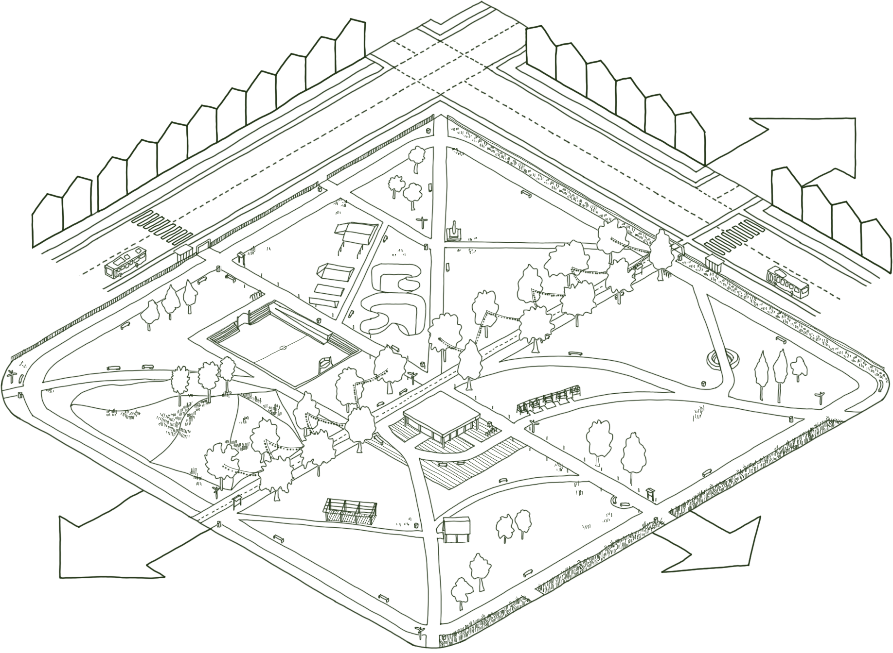
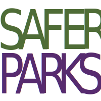
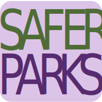

[Collaboration driving safer public spaces ]{.emphasis}

The Safer Parks Dashboard has been shaped through close collaboration with organisations committed to improving safety, access, and inclusion in parks. 

The work has supported by: 

- West Yorkshire Combined Authority 
- Local authorities across West Yorkshire 
- West Yorkshire Police  
- Keep Britain Tidy/Green Flag Awad 
- Police Crime Prevention Initiatives/Secured by Design 
- Friends of Parks groups and community organisations, whose local knowledge and lived experience inform the design and validation of the dashboard 

::: {.carousel}

{fig-align="center" width="100%"}

{fig-align="center" width="100%"}

{fig-align="center" width="100%"}

{fig-align="center" width="100%"}

{fig-align="center" width="100%"}

{fig-align="center" width="100%"}

{fig-align="center" width="100%"}

{fig-align="center" width="100%"}

{fig-align="center" width="100%"}

{fig-align="center" width="100%"}

{fig-align="center" width="100%"}

{fig-align="center" width="100%"}

:::

